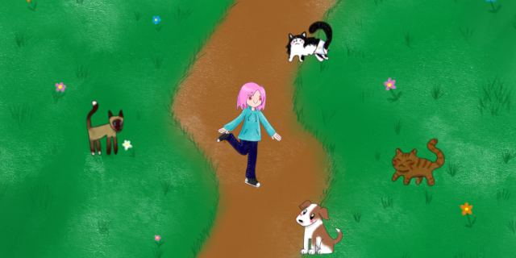

# La loca de los gatos

This game is for my students at Ironhack, so that they have an example of the game they should do for module 1.

## Description

"La loca de los gatos" is a simple game where you have to catch the cute kittens to earn your crazy title. On the other hand if you pick up dogs you move away from your goal.

## User stories MVP

- user can see a start screen with instructions and a finish screen when he wins / loses
- user can see a canvas with a dog and a cat appearing on the screen
- colliding with dog makes user lose, with cat makes user win

## User stories Backlog

- New levels
- Chronometer

## File structure

- <code>game.js</code>: contains all the elements for the game to work. Methods: generateCats(), generateCatsLeft(), generateDogs(), drawCats(), drawDogs(), drawUser(), clean(), checkCollisionsCat(), checkCollisionsDog(), writeScore(), update(), assignControls(), gameOver(), gameOverLose(), start().
- <code>player.js</code>: constructor for the game. Methods: moveRight(), moveLeft(), moveUp(), moveDown().
- <code>cats.js</code>: constructor for the cats. Methods: moveRight(), assignImageRight(), moveLeft(), assignImageLeft().
- <code>dogs.js</code>: constructor for the dogs. Methods: fallUp(), assignImage().
- <code>images.js</code>: contains the images and resources for the game.

## Useful links

<ul>
<li><a href="https://slides.com/estefaniaegeacalcena/deck">Presentation slides</a></li>
<li><a href="https://zilliontrout.github.io/La-loca-de-los-gatos/">Deployed game</a></li>
</ul>
